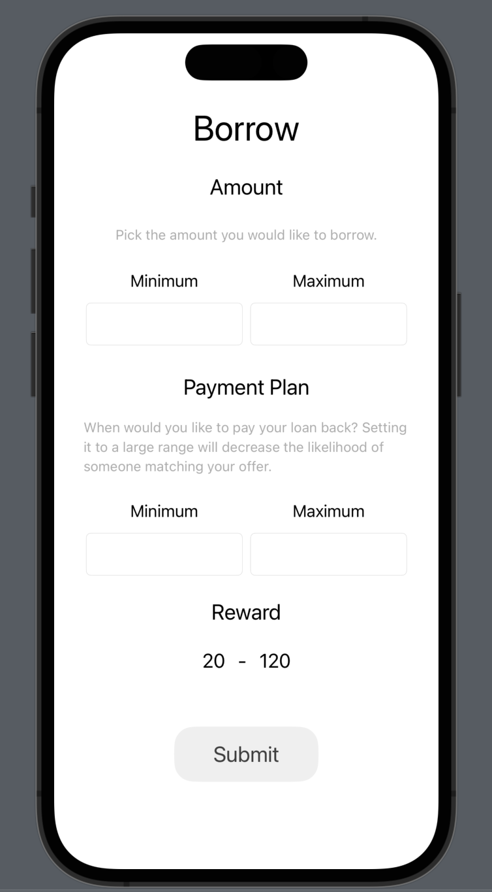
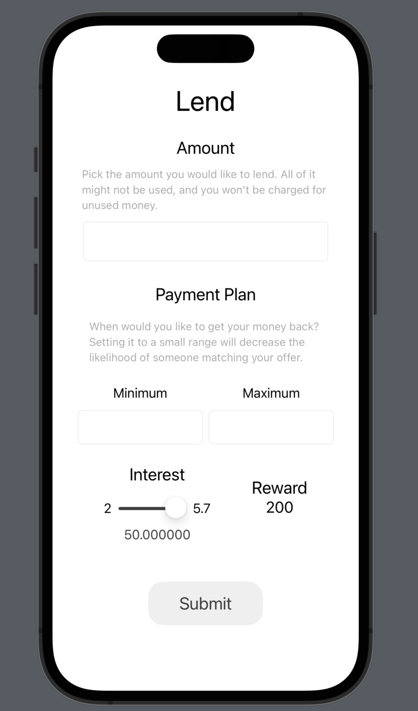

# Hack Technology / Project Attempted

## What you built? 

I came up with an idea to potentially pursue as my project for the class and tried to build some of its components. In basic terms, the app will allow people to lend to and borrow from peers. Lenders will enter the amount of money they want to loan and the interest rate they want to loan at and borrowers will enter a range of amount of money they'd like to borrow. Using mathematical optimization, the app will find the most optimal allocation of these loans to borrowers. At this step, I was able to make a very basic frontend using SwiftUI and modeling of the optimization using CPLEX.

Figma Link: https://www.figma.com/file/yfLgd7Y2kLOwQVhwYFqwzp/Untitled?node-id=0%3A1

## Who Did What?

I did everything as I worked alone.

## What you learned

Although I have some experience building apps with SwiftUI, it has been 2 years since I used it. So I had to learn most of the things from scratch. I also learned how to use CPLEX to model optimization problems with its Python API (which isn't pleasant).

## Authors

Barkin Cavdaroglu

## Acknowledgments

https://developer.apple.com/tutorials/swiftui/creating-and-combining-views
https://github.com/IBMDecisionOptimization/docplex-examples/blob/18bc95d1c89a268625571c38f93a33f851cdf48f/examples/mp/jupyter/tutorials/Beyond_Linear_Programming.ipynb
https://www.hackingwithswift.com/quick-start/swiftui
